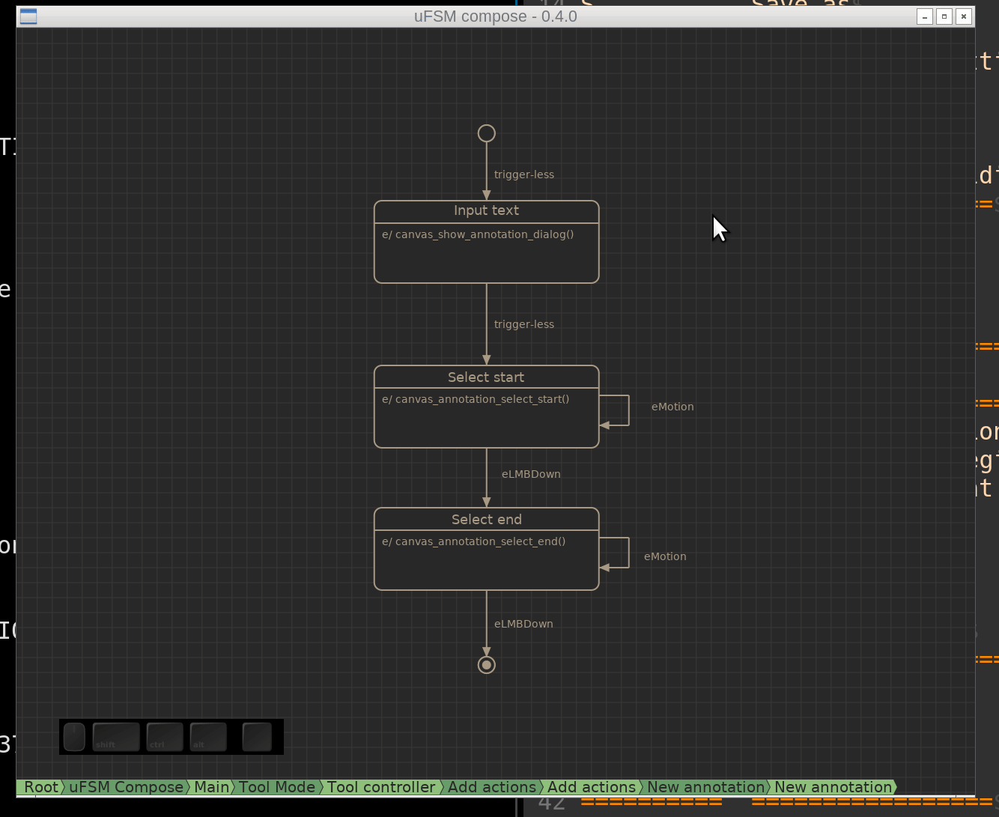

.. image:: https://codecov.io/gh/jonasblixt/ufsm/branch/master/graph/badge.svg
  :target: https://codecov.io/gh/jonasblixt/ufsm
.. image:: https://travis-ci.com/jonasblixt/ufsm.svg?branch=master
    :target: https://travis-ci.com/jonasblixt/ufsm
.. image:: https://scan.coverity.com/projects/15860/badge.svg
    :target: https://scan.coverity.com/projects/jonasblixt-ufsm
.. image:: https://readthedocs.org/projects/ufsm/badge/?version=latest
    :target: https://ufsm.readthedocs.io/en/latest/?badge=latest
    :alt: Documentation Status

uFSM is a library and tool for running and creating hierarchical state machines.

-----------------------
Building and installing
-----------------------

Building using the docker environment::

    $ ./build_docker.sh
    $ ./run_docker.sh
    $ autoreconf -fi
    $ mkdir build && cd build/
    $ ../configure
    $ make
    $ ./ufsm-compose/ufsm-compose

Dependencies:

==========  ===================
Package     Ubuntu package name
==========  ===================
automake    automake, autoconf-archive, autoconf, pkgconf
libtool     libtool
uuid        uuid-runtime, uuid-dev
GTK 3       libgtk-3-0, libgtk-3-dev
==========  ===================

Running tests::

    $ ./configure --enable-code-coverage
    $ make && make check

Documentation is available here: `uFSM documentation`_

.. _uFSM documentation: http://ufsm.readthedocs.io/en/latest
