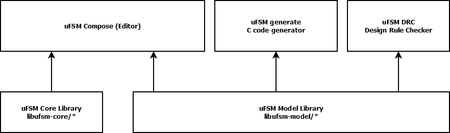

Architecture
============

uFSM Core Library
-----------------

This is the state machine run time library. The application should embedd
or link against this library and combined with the generated code
it produces a working state machine.

uFSM Model Library
------------------

The model librarys main responsibilty is to serialise/de-serialise the uFSM
model files. It provides a high level API for creating state machine model files.
The main use case is for the uFSM tools (compose, generate and drc).

uFSM Compose
------------

This is the state machine editor

uFSM Generate
-------------

Code generator tool that translate model files into C code

uFSM DRC
--------

The uFSM Design rule checker that performs DRC on model files.
