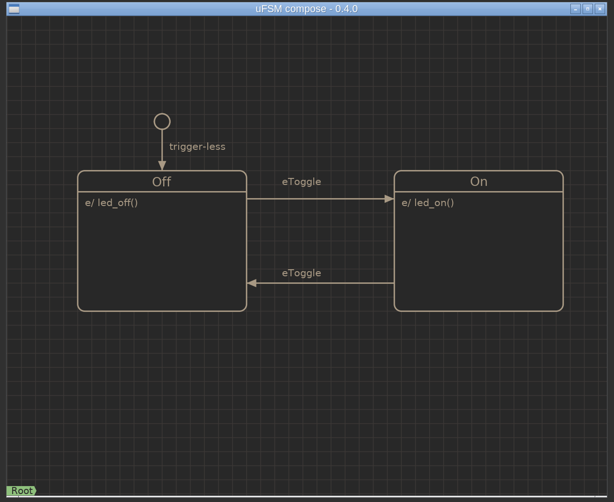

.. _example-simple:

------
Simple
------

This example demonstrates a simple toggle switch. When the machine
is initializes to the off state, which turns the led off.

By sending the eToggle event the led is toggled between the on and off states.

Source code: :github-tree:`examples/simple`

