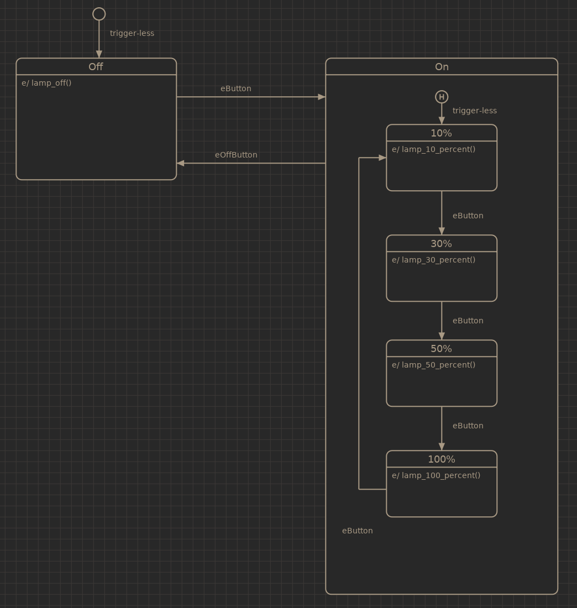

.. _example-dimmer:

------
Dimmer
------

The dimmer example is an example of a simple dimmer logic, a device with two
buttons. One ON/Toggle button and one off button.

The expected behaviour when pressing the on button is to turn the lights on
at the last intensity level set. Pressing the on button again will cycle through
the various intensity settings.

This example uses the history pseudo state to store the last used intensity 
setting.

Source code: :github-tree:`examples/dimmer`
