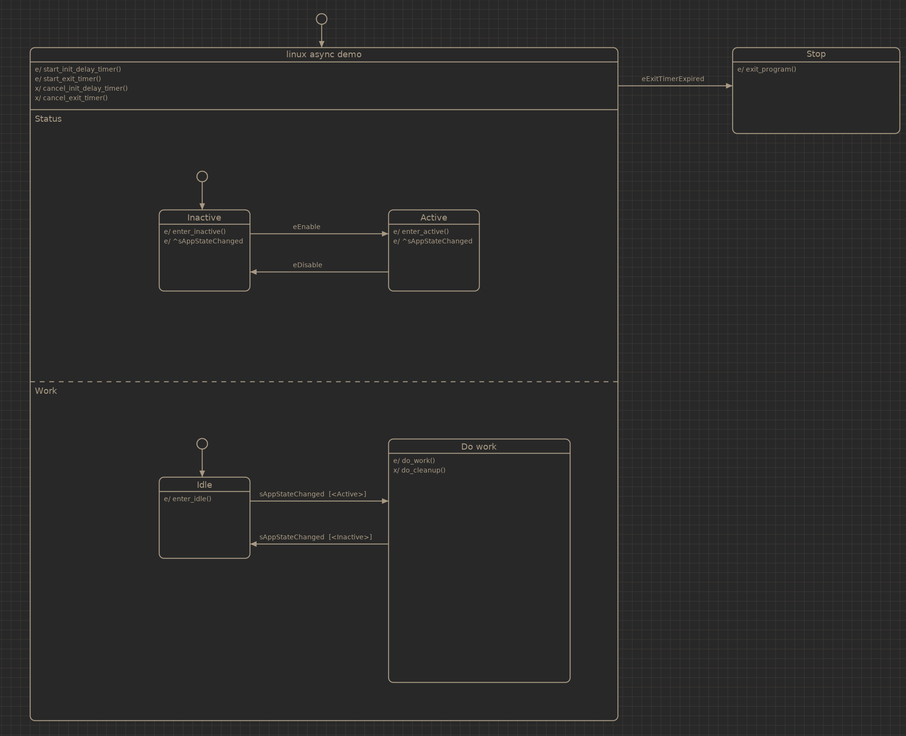

.. _example-linux-async:

----------------
Async linux demo
----------------

This example showcases a number of different things:

 * Emitting signals with the '^' event prefix
 * Using a state condition guard
 * De-coupling the state machine with a thread safe queue
 * Timer events using linux's timerfd
 * Event queue using linux's signalfd
 * epoll -based main event loop

This example uses a 'private context' for the machine::

    struct private_ctx {
        struct ufsm_queue *q;
        struct ufsm_timer tmr, tmr_exit;
        int epoll_fd;
        bool run;
    };

This is passed to all action functions through the 'context' parameter.

Main loop::

    /* Initialize the queue to hold 128 int's */
    q = ufsm_queue_init(priv.epoll_fd, 128);
    priv.q = q;

    ufsm_debug_machine(&m.machine);
    ufsm_configure_emit_handler(&m.machine, emit_handler);
    ufsm_timer_init(&priv.tmr, priv.epoll_fd, q, 1500, eEnable);
    ufsm_timer_init(&priv.tmr_exit, priv.epoll_fd, q, 5000, eExitTimerExpired);

    emit_machine_initialize(&m, &priv);

    for (;;) {
        int no_of_fds = epoll_wait(priv.epoll_fd, events, MAX_EVENTS, -1);

        if (no_of_fds == -1) {
            fprintf(stderr, "epoll_wait failed\n");
            rc = -1;
            goto err_free_timers_out;
        }

        for (int n = 0; n < no_of_fds; n++) {
            int fd = events[n].data.fd;

            if (ufsm_timer_get_fd(&priv.tmr) == fd) {
                ufsm_timer_handle(&priv.tmr);
            } else if (ufsm_timer_get_fd(&priv.tmr_exit) == fd) {
                ufsm_timer_handle(&priv.tmr_exit);
            } else if (ufsm_queue_get_fd(q) == fd) {
                uint64_t no_of_queue_events;

                if (ufsm_queue_handle(q, &no_of_queue_events) != 0) {
                    fprintf(stderr, "Failed to read queue events\n");
                    priv.run = false;
                    rc = -1;
                    break;
                }

                for (int i = 0; i < no_of_queue_events; i++) {
                    emit_machine_process(&m, ufsm_queue_pop(q));
                }
            }
        }

The queue, timers and the state machine are initialized. The 'tmr' timer is used
to send the event 'eEnable' after 1500 ms.

The 'tmr_exit' timer will send 'eExitTimerExpired' after 5000ms and terminating
the program.

The queue uses a signalfd 'object' to wake up the epoll when there are new
events in the queue.

Source code: :github-tree:`examples/linux`
