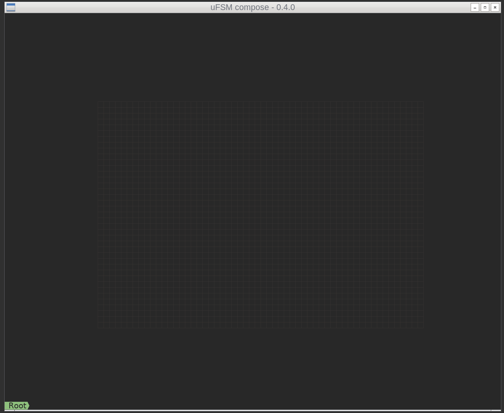
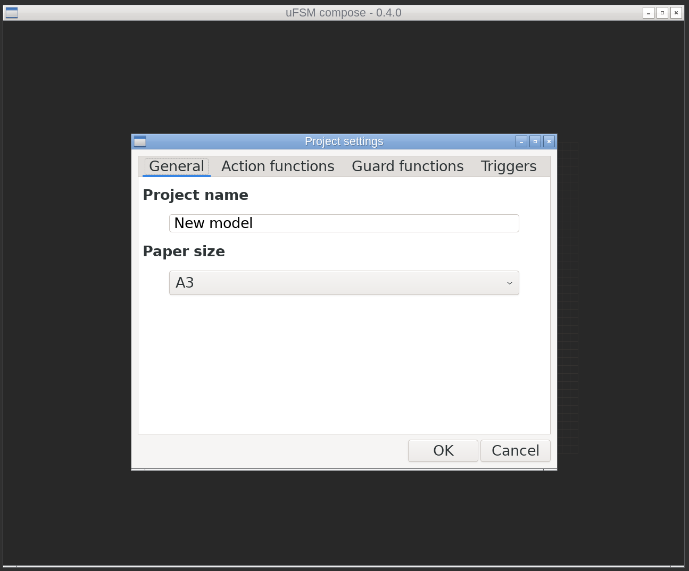

.. _ug-simple-project:

-----------------------
Create simple a project
-----------------------

Open the compose editor by running 'ufsm-compose'.

A good start is to open the project settings menu and set a project name and
maybe adjust the canvas size. The project settings menu is opened by pressing 'p'

Create a model by adding normal states 'a-s' (Add state).
Set the state names by pressing 'e-n' (Edit - name). 

See :ref:`ug-editor-commands` for a more comprehensive list of commands.

.. image:: ../compose_demo_project.png

Translate model to code::

    $ ufsm-generate --input led.ufsm --output led

This command generated led.c and led.h which contains the state machine.
These two files should be linked together width ufsm.c (or libufsm-core) to
produce a working state machine.

Example code::

    #include <ufsm/ufsm.h>
    #include <stdio.h>
    #include "led.h"

    void led_on(void *context)
    {
        printf ("LED ON\n");
    }

    void led_off(void *context)
    {
        printf ("LED OFF\n");
    }

    int main(int argc, char **argv)
    {
        struct led_machine m;

        ufsm_debug_machine(&m.machine);
        led_machine_initialize(&m, NULL);

        led_machine_process(&m, eToggle);
        led_machine_process(&m, eToggle);
        led_machine_process(&m, eToggle);
        led_machine_process(&m, eToggle);
        led_machine_process(&m, eToggle);

        return 0;
    }

Build the example::

    gcc simple.c led.c -lufsm-core -o led

Expected output::

     EV |     OP     | Details
        | Transition | Init {Init} --> Off {Simple State} T=COMPLETION
        | S exit     | Init {Init}
        | S enter    | Off {Simple State}
        | Call       | led_off
    LED OFF
     0  |            |
        | Transition | Off {Simple State} --> On {Simple State} T=eToggle 
        | S exit     | Off {Simple State}
        | S enter    | On {Simple State}
        | Call       | led_on
    LED ON
     0  |            |
        | Transition | On {Simple State} --> Off {Simple State} T=eToggle 
        | S exit     | On {Simple State}
        | S enter    | Off {Simple State}
        | Call       | led_off
    LED OFF
     0  |            |
        | Transition | Off {Simple State} --> On {Simple State} T=eToggle 
        | S exit     | Off {Simple State}
        | S enter    | On {Simple State}
        | Call       | led_on
    LED ON
     0  |            |
        | Transition | On {Simple State} --> Off {Simple State} T=eToggle 
        | S exit     | On {Simple State}
        | S enter    | Off {Simple State}
        | Call       | led_off
    LED OFF
     0  |            |
        | Transition | Off {Simple State} --> On {Simple State} T=eToggle 
        | S exit     | Off {Simple State}
        | S enter    | On {Simple State}
        | Call       | led_on
    LED ON

Source code: :github-blob:`examples/simple`
