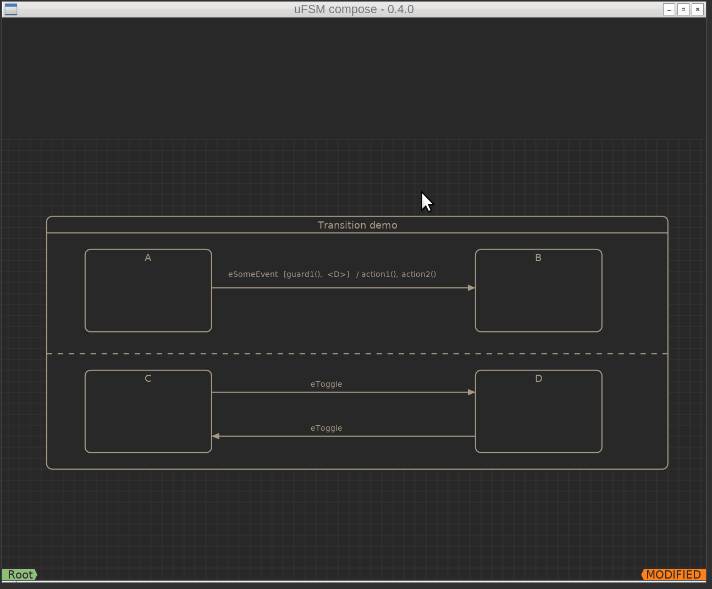
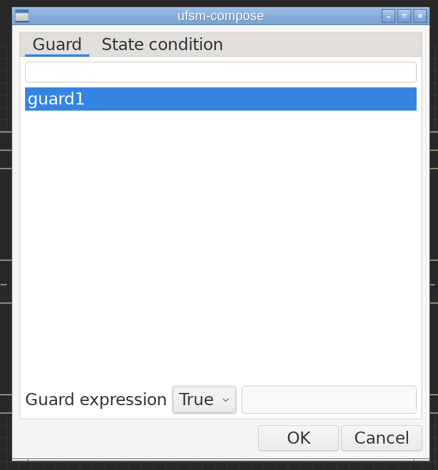

.. _ug-transitions:

-----------
Transitions
-----------

Transitions in uFSM are always 'external'. This means that whenever a transition
is executed the source state will always execute it's exit actions regardless
if the destination is the same state.

A transition has a trigger event or is 'trigger-less'. Transitions can optionally
have guards which are evaluated (and all must equate to 'true') before the
transition can execute.

Transition guards
-----------------

uFSM supports normal guards which are user defined functions called by the
state machine. Guards are added by pressing 'a-g' on a selected transition.

A guard expression can also be defined instead of a boolean return value.
guard functions must be defined with 'int' as return type to support these
expressions.

It's also possible to create state condition guards, this means that the guard
expression checks if a state in an orthogonal region is active (or not).
In the transition between states A and B the transition has a guard '<D>'.
This is a state condition guard which only allows the transition to execute
if the state machine is also in the state 'D'.

Trigger less transitions
------------------------

Sometimes it's desired to execute a transition when all entry and exit actions of a state has
executed. The simplest example is transitions from initial states, which is 
a special state that does not allow triggers or guards on the outgoing transition.

Action functions
----------------

Action functions on a transition are called when the transition is triggered by
some event and if all guards evaluate to true.

Re-ordering action functions and guards
---------------------------------------

The execution order of guards and actions can be re-ordered by selecting
a guard or action of interest and moving the mouse cursor while holding down
the left mouse button.

