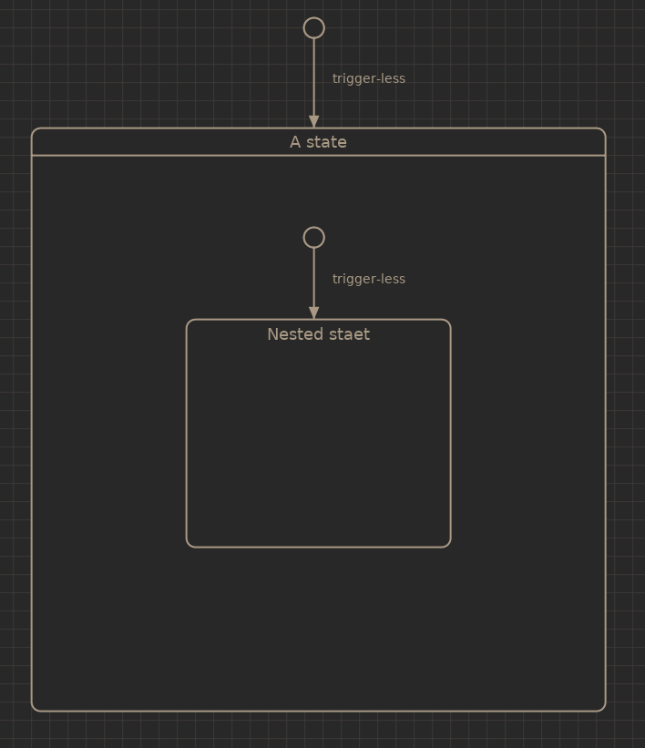
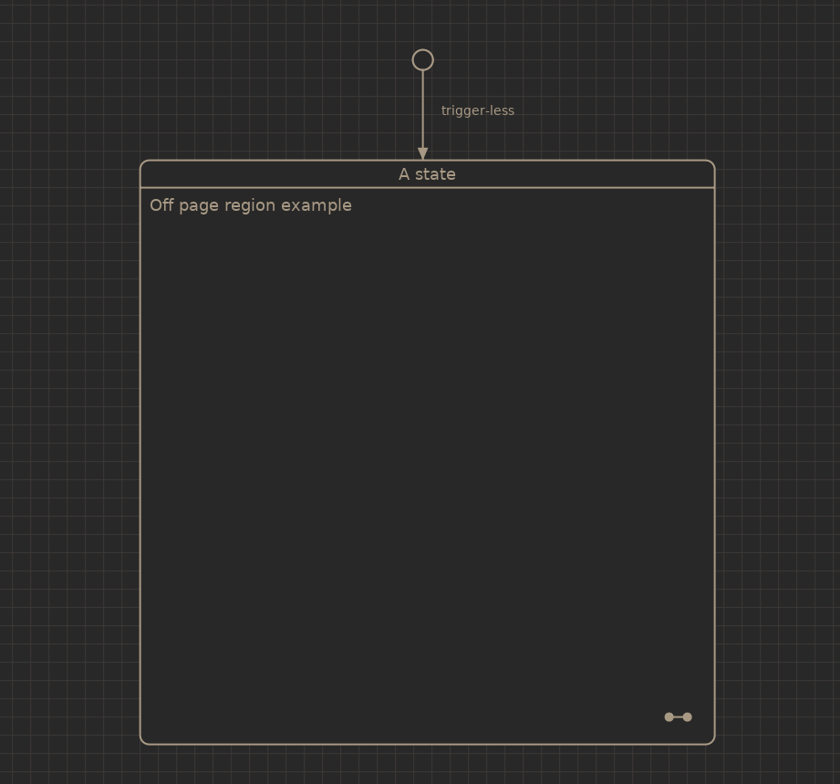

.. _ug-states:

------
States
------

One or more states can reside in a region and states can have regions.
This way a hierarchical state machine's can be constructed.

Only one state can be active at the same time in the same region. A state
can however have more than one region, then they are called orthogonal because
they are active at the same time and can model parallel states.

Normal states
-------------

Normal states have entry and exit actions which are called when the state is
entered or exited.

Actions are executed in the order they are shown in the editor and can be
re ordered by clicking and dragging on an action of interest.

Nested states
-------------

Nested (or composit) states have one or more regions which in turn contains
other states.

Off-page regions
----------------

To make a complex machine more manageable a region can be set to 'off-page'.
This way the contents of that region is not displayed. When an off-page region
is double-clicked the root view is switched to that region.

Note the symbol in the bottom right corner, this indicates an off-page region.

Overview of special states
--------------------------

========================  =================
Graphical representation  Description
========================  =================
|img_state_init|          First state that is initialized in a region
|img_state_hist|          History state
|img_state_dhist|         Deep history state
|img_state_final|         Final state
|img_state_term|          Terminate state
|img_state_fork_join|     Fork or join state
========================  =================

History states
--------------

In uFSM a history state is like an initial state, when the state machine
encounters a region with a history state for the first time it's treated like
a normal init state. The difference is that when the region that contains
the history state is exited the last active state is stored and up on entry
at a later time the last state will be activated.

The deep history state is the same but it also keeps track of any nested states
relative to the deep history state.

See :ref:`example-dimmer` for an example.

Fork and join states
--------------------

Fork and join states are used to synchronzise concurrent execution of states.

Final state
-----------

The final state is used to indicate that a region has reached it's final state.
When a final state has been reached it will trigger a completion event of the
parent state.

Terminate state
---------------

The terminate state is used to stop the state machine. When a terminate state
has been reached the machine will stop executing and will not respond to any
additional events.

